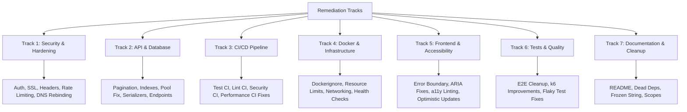

# Adversarial Review — Findings and Remediation Plan

## Table of Contents

- [Overview](#overview)
- [Severity Summary](#severity-summary)
- [Remediation Tracks](#remediation-tracks)
- [Findings and Remediations](#findings-and-remediations)
  - [Critical Findings](#critical-findings)
  - [High Findings](#high-findings)
  - [Medium Findings](#medium-findings)
  - [Low Findings](#low-findings)
- [Recommended Remediation Order](#recommended-remediation-order)
- [Tracking Matrix](#tracking-matrix)

## Overview

This document captures all 66 findings from the adversarial review of the bmad-todo codebase conducted on 2026-02-26. Each finding includes a description, affected files, and a concrete remediation action. Findings are grouped by severity and organized into remediation tracks for efficient parallel work.

**Scope:** Full codebase — Rails API, React client, Docker/Compose configuration, CI/CD, Nginx, E2E and performance tests.

## Severity Summary

| Severity | Count | Description |
|----------|-------|-------------|
| **CRITICAL** | 10 | Security vulnerabilities, missing safeguards, and bugs that cause failures under normal operation |
| **HIGH** | 15 | Scalability blockers, incorrect configuration, missing API capabilities, and unsafe patterns |
| **MEDIUM** | 26 | Suboptimal defaults, redundant code, missing hardening, accessibility gaps, and test fragility |
| **LOW** | 15 | Style inconsistencies, dead dependencies, missing tooling configuration, and documentation gaps |

## Remediation Tracks

Group related findings to address them efficiently in parallel streams.



## Findings and Remediations

### Critical Findings

#### C1. Zero Authentication or Authorization

**Affected:** All API endpoints (`app/controllers/tasks_controller.rb`, `config/routes.rb`)

Every endpoint is open to the public. Anyone who discovers the URL can create, modify, and delete every task.

**Remediation:**

- Add token-based authentication (JWT or API key middleware).
- Add an `authenticate!` before_action to `ApplicationController`.
- Return `401 Unauthorized` for unauthenticated requests.

---

#### C2. No CI Pipeline for Tests, Linting, or Security Scanning

**Affected:** `.github/workflows/` (only `performance.yml` exists)

No backend tests, no frontend unit tests, no E2E tests, no RuboCop, no ESLint, no `bundle audit`, no `npm audit`, no Docker image scanning, no SAST run in CI. Broken code merges green.

**Remediation:**

- Create `.github/workflows/ci.yml` with jobs for:
  - `backend-tests`: `bundle exec rails test`
  - `frontend-tests`: `npm test`
  - `e2e-tests`: Playwright suite
  - `lint`: RuboCop + ESLint
  - `security`: `bundle audit`, `npm audit`, `brakeman`
- Trigger on `pull_request` and `push` to `main`.

---

#### C3. Performance CI Triggers Post-Merge Only

**Affected:** `.github/workflows/performance.yml` (lines 3-6)

Performance regressions are detected after they land on `main`, not during pull request review.

**Remediation:**

- Add `pull_request: branches: [main]` to the trigger configuration.
- Keep the existing `push` trigger for baseline tracking.

---

#### C4. No Rate Limiting on the API

**Affected:** `bmad-todo-api/Gemfile`, `bmad-todo-api/config/initializers/`

No `rack-attack` or equivalent middleware. A tight loop on `POST /tasks` fills the database until Postgres falls over.

**Remediation:**

- Add `gem 'rack-attack'` to the Gemfile.
- Create `config/initializers/rack_attack.rb` with throttle rules (e.g., 60 requests/minute per IP for mutations).
- Return `429 Too Many Requests` when limits are exceeded.

---

#### C5. SSL Not Enforced in Production

**Affected:** `bmad-todo-api/config/environments/production.rb`

Both `config.assume_ssl` and `config.force_ssl` are commented out. All traffic travels in plaintext, including any future auth tokens.

**Remediation:**

- Uncomment and enable `config.force_ssl = true`.
- Uncomment `config.assume_ssl = true` if running behind an SSL-terminating proxy (e.g., a load balancer).

---

#### C6. DNS Rebinding Protection Disabled

**Affected:** `bmad-todo-api/config/environments/production.rb`

`config.hosts` is commented out. Any `Host` header is accepted, enabling DNS rebinding attacks and cache poisoning.

**Remediation:**

- Uncomment `config.hosts` and set it to the production domain(s).
- Use `config.hosts << ENV["ALLOWED_HOST"]` for environment-driven configuration.

---

#### C7. `database.yml` Uses `max_connections` Instead of `pool`

**Affected:** `bmad-todo-api/config/database.yml`

ActiveRecord ignores the unknown `max_connections` key. The connection pool defaults to 5 regardless of `RAILS_MAX_THREADS`. Setting `RAILS_MAX_THREADS=10` causes `ActiveRecord::ConnectionTimeoutError` under load.

**Remediation:**

- Rename `max_connections` to `pool` in all database configuration blocks.
- Set value to `<%= ENV.fetch("RAILS_MAX_THREADS") { 5 } %>`.

---

#### C8. No React Error Boundary

**Affected:** `bmad-todo-client/src/` (entire React tree)

If any component throws during render, the entire app becomes an unrecoverable white screen with no message, retry, or escape.

**Remediation:**

- Create an `ErrorBoundary` component using `componentDidCatch` or a library like `react-error-boundary`.
- Wrap the root `<App />` in the error boundary.
- Display a user-friendly fallback with a retry action.

---

#### C9. Nginx Serves Zero Security Headers

**Affected:** Nginx configuration (Docker client setup)

No `X-Content-Type-Options`, `X-Frame-Options`, `Content-Security-Policy`, `Strict-Transport-Security`, `Referrer-Policy`, or `Permissions-Policy`. No gzip/brotli compression. No cache-control headers.

**Remediation:**

- Add security headers to the nginx `server` block:

```nginx
add_header X-Content-Type-Options "nosniff" always;
add_header X-Frame-Options "DENY" always;
add_header Referrer-Policy "strict-origin-when-cross-origin" always;
add_header Permissions-Policy "camera=(), microphone=(), geolocation=()" always;
add_header Content-Security-Policy "default-src 'self'; script-src 'self'; style-src 'self' 'unsafe-inline';" always;
```

- Enable gzip compression for text-based assets.
- Add `Cache-Control` headers for static assets.

---

#### C10. Race Condition on Concurrent Checkbox Toggling

**Affected:** `bmad-todo-client/src/` (state management for `completingId`)

`completingId` is a single `number | null`. Clicking two checkboxes quickly re-enables the first while its PATCH is still in flight, allowing duplicate or conflicting requests.

**Remediation:**

- Replace `completingId: number | null` with `completingIds: Set<number>`.
- Add the task ID to the set on toggle start, remove on completion.
- Disable each checkbox individually based on set membership.

---

### High Findings

#### H1. No Pagination on `GET /tasks`

**Affected:** `app/controllers/tasks_controller.rb` (index action)

`Task.order(created_at: :asc)` loads every task into memory. At scale, this causes OOM or multi-second responses.

**Remediation:**

- Add `limit`/`offset` or cursor-based pagination.
- Accept `?page=` and `?per_page=` query parameters.
- Return pagination metadata in the response envelope (total count, next page).

---

#### H2. No Database Indexes on Queried Columns

**Affected:** `db/migrate/` (tasks table migration)

No index on `created_at` (used in every `ORDER BY`) or `completed` (the most obvious filter). Every request triggers a sequential scan.

**Remediation:**

- Generate a migration adding indexes:

```ruby
add_index :tasks, :created_at
add_index :tasks, :completed
```

---

#### H3. No Length Constraint on `title` at the Database Level

**Affected:** Tasks table schema

The model validates `maximum: 255` but the column has no `:limit`. Anything bypassing ActiveRecord faces no constraint.

**Remediation:**

- Add a migration to set the column limit:

```ruby
change_column :tasks, :title, :string, limit: 255
```

---

#### H4. Contradictory Production Database Config

**Affected:** `bmad-todo-api/config/database.yml` (production block)

When `DATABASE_URL` is set (required), it overrides `database`, `username`, and `password`. Those explicit values are dead code that gives a false impression.

**Remediation:**

- Remove the explicit `database`, `username`, and `password` keys from the production block.
- Document that production relies exclusively on `DATABASE_URL`.

---

#### H5. Unnecessary Production Databases

**Affected:** `bmad-todo-api/config/database.yml` (solid_cache, solid_queue, solid_cable)

Three additional databases are demanded in production for features the app does not use (no background jobs, no WebSockets, no database-backed caching).

**Remediation:**

- Remove `solid_cache_production`, `solid_queue_production`, and `solid_cable_production` blocks from `database.yml`.
- Remove or comment out the corresponding framework references in `application.rb` if present.

---

#### H6. Base `docker-compose.yml` Mixes Production Mode with Dev Database

**Affected:** `docker-compose.yml`

`RAILS_ENV: production` connects to `bmad_todo_api_development` with password `bmad_todo_api` in plaintext. CI uses this file.

**Remediation:**

- Rename the database to a neutral name (e.g., `bmad_todo_api`).
- Move credentials to environment variables with no default value.
- Document that `.env` is required for all compose invocations.

---

#### H7. `SECRET_KEY_BASE` Defaults to Empty String

**Affected:** `docker-compose.yml`

`SECRET_KEY_BASE: ${SECRET_KEY_BASE:-}` defaults to empty, causing Rails to fail with a cryptic error.

**Remediation:**

- Remove the default: `SECRET_KEY_BASE: ${SECRET_KEY_BASE}` (Docker Compose errors explicitly when the variable is unset).
- Alternatively, add a startup check in the entrypoint that fails fast with a clear message.

---

#### H8. Root `.dockerignore` Is Irrelevant

**Affected:** `.dockerignore`, `bmad-todo-api/`, `bmad-todo-client/`

Build contexts are subdirectories, so the root `.dockerignore` never applies. No `.dockerignore` files exist in the subdirectories.

**Remediation:**

- Create `bmad-todo-api/.dockerignore` and `bmad-todo-client/.dockerignore` with appropriate exclusions (test files, `.env`, `node_modules`, etc.).

---

#### H9. Unsafe `as` Type Assertions on API Responses

**Affected:** `bmad-todo-client/src/` (API layer)

`res.json()` is cast with `as TasksResponse` providing zero runtime validation. Malformed responses silently pass through and crash downstream.

**Remediation:**

- Add runtime validation using a schema library (e.g., Zod):

```typescript
const TaskSchema = z.object({ id: z.number(), title: z.string(), completed: z.boolean() });
const TasksResponseSchema = z.object({ tasks: z.array(TaskSchema) });
```

- Parse API responses through the schema before returning.

---

#### H10. No Input Length Validation on the Frontend

**Affected:** `bmad-todo-client/src/` (task input component)

No `maxLength` attribute on the task input. A user or script can submit 100,000 characters with no client-side feedback.

**Remediation:**

- Add `maxLength={255}` to the input element.
- Display a character count or warning near the limit.

---

#### H11. Postgres Port Exposed to All Interfaces

**Affected:** `docker-compose.yml` (db service)

Port 5432 binds to `0.0.0.0`, exposing the database to the entire network.

**Remediation:**

- Bind to localhost only: `"127.0.0.1:5432:5432"`.

---

#### H12. Inconsistent API Response Envelope

**Affected:** `app/controllers/tasks_controller.rb`

Index wraps in `{ tasks: [...] }`, create/update return bare objects, destroy returns `204`. The frontend must handle two different response shapes.

**Remediation:**

- Standardize all mutation responses to wrap in the same envelope: `{ task: { ... } }`.
- Keep `204 No Content` for destroy.

---

#### H13. Update Cannot Modify `title`

**Affected:** `app/controllers/tasks_controller.rb` (`update_params`)

`update_params` only permits `:completed`. A typo in a task title requires delete-and-recreate.

**Remediation:**

- Add `:title` to `update_params`:

```ruby
def update_params
  params.require(:task).permit(:completed, :title)
end
```

---

#### H14. No `show` Endpoint

**Affected:** `config/routes.rb`, `app/controllers/tasks_controller.rb`

No way to fetch a single task by ID. Any client needing one resource must re-fetch the entire list.

**Remediation:**

- Add a `show` action to `TasksController`.
- Update routes: `resources :tasks, only: [:index, :create, :update, :destroy, :show]`.

---

#### H15. No API Versioning

**Affected:** `config/routes.rb`

Routes mounted directly at `/tasks`. Any breaking change hits every client simultaneously.

**Remediation:**

- Namespace routes under `/api/v1/tasks`.
- Update the frontend `VITE_API_URL` accordingly.

---

### Medium Findings

#### M1. CORS Is Overly Permissive

**Affected:** `bmad-todo-api/config/initializers/cors.rb`

`resource "*"` allows CORS on every route. `headers: :any` accepts arbitrary headers. No `max_age` for preflight caching.

**Remediation:**

- Scope CORS to `/tasks*` only.
- Whitelist specific headers instead of `:any`.
- Add `max_age: 86400` for preflight caching.

---

#### M2. `ApplicationController` Only Rescues `ParseError`

**Affected:** `app/controllers/application_controller.rb`

No handlers for `RecordNotFound`, `ParameterMissing`, generic `StandardError`, or `StatementInvalid`. Unhandled exceptions return raw 500s and leak Postgres internals.

**Remediation:**

- Add `rescue_from` blocks for common exceptions:

```ruby
rescue_from ActiveRecord::RecordNotFound, with: :not_found
rescue_from ActionController::ParameterMissing, with: :bad_request
rescue_from StandardError, with: :internal_error
```

---

#### M3. Duplicated Not-Found Logic

**Affected:** `app/controllers/tasks_controller.rb` (update, destroy)

Identical `find_by` + nil check is copy-pasted in both actions.

**Remediation:**

- Extract to `before_action :set_task, only: [:update, :destroy]`.
- Use `find` instead of `find_by` and let `RecordNotFound` bubble to the global rescue.

---

#### M4. `as_json(only: ...)` Whitelist Repeated Three Times

**Affected:** `app/controllers/tasks_controller.rb`

When a field is added, one occurrence will be forgotten.

**Remediation:**

- Extract to a constant or serializer method on the model:

```ruby
TASK_JSON_FIELDS = %i[id title completed created_at updated_at].freeze
```

---

#### M5. `require "rails/all"` Loads Unnecessary Frameworks

**Affected:** `bmad-todo-api/config/application.rb`

ActionMailer, ActiveStorage, ActionCable, ActionView, and ActiveJob are loaded but never used. Wasted memory, boot time, and attack surface.

**Remediation:**

- Replace `require "rails/all"` with explicit requires for only the needed frameworks:

```ruby
require "active_record/railtie"
require "active_model/railtie"
require "action_controller/railtie"
```

---

#### M6. `image_processing` Gem in the Gemfile

**Affected:** `bmad-todo-api/Gemfile`

There are no images in the application. This pulls in `libvips`/`ImageMagick` native deps and bloats the Docker image.

**Remediation:**

- Remove `gem "image_processing"` from the Gemfile and run `bundle install`.

---

#### M7. `BUNDLE_WITHOUT` Doesn't Exclude Test Gems

**Affected:** `bmad-todo-api/Dockerfile`

`BUNDLE_WITHOUT="development"` keeps test gems (`simplecov`, `bundler-audit`, `brakeman`, `rubocop-rails-omakase`) in the production image.

**Remediation:**

- Change to `BUNDLE_WITHOUT="development:test"`.

---

#### M8. `db:migrate` in Docker Entrypoint Is Risky

**Affected:** `bmad-todo-api/` (entrypoint script or Dockerfile CMD)

Running migrations on every container start with multiple replicas causes concurrent migration attempts and potential lock contention.

**Remediation:**

- Remove `db:migrate` from the entrypoint.
- Run migrations as a separate one-shot job (e.g., a Kubernetes Job or a dedicated `docker compose run` step) before deploying new containers.

---

#### M9. No Container Resource Limits

**Affected:** `docker-compose.yml`, `docker-compose.dev.yml`, `docker-compose.test.yml`

No `mem_limit`, `cpus`, or `pids_limit` on any service. A memory leak or runaway query can OOM the host.

**Remediation:**

- Add resource limits to each service:

```yaml
deploy:
  resources:
    limits:
      memory: 512M
      cpus: "1.0"
```

---

#### M10. `docker-compose.test.yml` Bakes Unreachable API URL

**Affected:** `docker-compose.test.yml`

`VITE_API_URL: http://api:3000` is baked into the client bundle. Browsers on the host cannot resolve `api`.

**Remediation:**

- Use `http://localhost:3000` for browser-based testing.
- Use `http://api:3000` only for server-side or container-to-container communication.

---

#### M11. `VITE_API_URL` Baked at Build Time

**Affected:** `bmad-todo-client/Dockerfile`

Every environment needs a separate image build. The same image cannot serve staging and production.

**Remediation:**

- Replace the build-time variable with a runtime-injected configuration (e.g., an `env.js` file generated by the entrypoint from environment variables at container start, or a `/config` endpoint).

---

#### M12. No `HEALTHCHECK` in Either Dockerfile

**Affected:** `bmad-todo-api/Dockerfile`, `bmad-todo-client/Dockerfile`

Container orchestrators cannot determine if containers are serving requests.

**Remediation:**

- Add `HEALTHCHECK` instructions:

```dockerfile
# API
HEALTHCHECK --interval=30s --timeout=5s CMD curl -f http://localhost:3000/up || exit 1

# Client
HEALTHCHECK --interval=30s --timeout=5s CMD curl -f http://localhost:8080/ || exit 1
```

---

#### M13. Multiple Competing `aria-live` Regions

**Affected:** `bmad-todo-client/src/` (announcement div, loading paragraph, EmptyState)

Multiple `aria-live="polite"` regions cause screen readers to double-announce or get confused about priority.

**Remediation:**

- Consolidate into a single announcement region.
- Use a dedicated `useAnnounce` hook that updates one `aria-live` region programmatically.

---

#### M14. Redundant `aria-label` on Checkbox Inside `<label>`

**Affected:** `bmad-todo-client/src/components/TaskRow.tsx`

`aria-label={task.title}` on the checkbox AND a wrapping `<label>` containing the title text. Screen readers announce the title twice.

**Remediation:**

- Remove the `aria-label` from the checkbox when it is already inside an associated `<label>`.

---

#### M15. No `eslint-plugin-jsx-a11y`

**Affected:** `bmad-todo-client/` (ESLint config)

The project claims accessibility support but has no accessibility linter. Regressions are caught only by manual review.

**Remediation:**

- Install `eslint-plugin-jsx-a11y` and add it to the ESLint configuration.

---

#### M16. Lighthouse CI Has No Accessibility Assertion

**Affected:** LHCI configuration

Performance is asserted; the accessibility score could drop to 20 and CI would remain green.

**Remediation:**

- Add an accessibility score assertion to the LHCI config:

```json
"accessibility": ["error", { "minScore": 0.9 }]
```

---

#### M17. `ecmaVersion: 2020` in ESLint vs `target: "ES2022"` in TypeScript

**Affected:** `bmad-todo-client/` (ESLint config, `tsconfig.app.json`)

ESLint cannot parse ES2021+ syntax, risking false-positive parsing errors.

**Remediation:**

- Update the ESLint `ecmaVersion` to `2022` (or `"latest"`) to match the TypeScript target.

---

#### M18. Missing `noUncheckedIndexedAccess` in `tsconfig.app.json`

**Affected:** `bmad-todo-client/tsconfig.app.json`

Array access like `tasks[0].title` compiles without null checks even when `tasks[0]` could be `undefined`.

**Remediation:**

- Add `"noUncheckedIndexedAccess": true` to `compilerOptions`.
- Fix any resulting type errors by adding appropriate null checks.

---

#### M19. Mixed CSS + Tailwind with Redundant `sr-only`

**Affected:** `bmad-todo-client/src/App.css`

`App.css` manually defines `.sr-only` claiming Tailwind v4 does not include it, but Tailwind v4 does. Two parallel styling systems with no clear boundary.

**Remediation:**

- Remove the manual `.sr-only` definition and use Tailwind's built-in `sr-only` utility.
- Decide on a single styling approach and document the convention.

---

#### M20. Playwright E2E Tests Cover Chromium Only

**Affected:** `bmad-todo-client/playwright.config.ts`

No Firefox, no WebKit/Safari, no mobile viewports. Cross-browser bugs go undetected.

**Remediation:**

- Add Firefox and WebKit projects to the Playwright config.
- Add a mobile viewport project for responsive testing.

---

#### M21. Deploy Config Is All Placeholders

**Affected:** `deploy.yml`

Private IP `192.168.0.1` and `localhost:5555` as the container registry. Will never work in any real deployment.

**Remediation:**

- Either remove the file until real deployment targets exist, or replace placeholders with environment-variable-driven configuration and document the required variables.

---

#### M22. No Docker Network Isolation

**Affected:** `docker-compose.yml`

All services share the default network. The nginx client can directly connect to Postgres.

**Remediation:**

- Define separate frontend and backend networks:

```yaml
networks:
  frontend:
  backend:

services:
  client:
    networks: [frontend]
  api:
    networks: [frontend, backend]
  db:
    networks: [backend]
```

---

#### M23. E2E Tests Never Clean Up Created Tasks

**Affected:** Playwright E2E test suite

Every test run accumulates orphaned tasks in the database. Over time, GET tests slow and ordering tests become meaningless.

**Remediation:**

- Add a `beforeEach` or `afterAll` hook that deletes all tasks via the API (e.g., `DELETE /tasks` or individual cleanup calls).
- Alternatively, reset the database between test runs using a dedicated test database.

---

#### M24. `waitForTimeout(500)` Anti-Pattern in E2E Tests

**Affected:** Playwright E2E test files

Hardcoded sleeps are flaky — too slow on fast machines, too fast on slow CI runners.

**Remediation:**

- Replace `waitForTimeout(500)` with condition-based waits:

```typescript
await expect(page.getByRole('checkbox')).toBeChecked();
```

---

#### M25. k6 PATCH Test: Concurrent VUs Race on Same Task IDs

**Affected:** `perf/` (k6 test scripts)

Multiple VUs randomly select from 15 seed IDs and PATCH simultaneously with conflicting `completed` values. This measures contention artifacts, not realistic behavior.

**Remediation:**

- Assign each VU a dedicated range of task IDs to avoid contention.
- Alternatively, have each VU create its own tasks in a setup phase and operate on those.

---

#### M26. k6 Test: 50 Iterations Across 3 VUs Is Statistically Weak

**Affected:** `perf/` (k6 test configuration)

~17 iterations per VU means a single outlier shifts p95 significantly. Random CI failures from noisy neighbors are expected.

**Remediation:**

- Increase iterations to at least 200 (or use a duration-based approach like `duration: '30s'`).
- Add a warm-up phase to stabilize results.

---

### Low Findings

#### L1. No `frozen_string_literal` Pragma Consistency

**Affected:** All Ruby files

`tasks_controller.rb` has the pragma; other files do not.

**Remediation:**

- Add `# frozen_string_literal: true` to all Ruby files.
- Enable the RuboCop rule to enforce this automatically.

---

#### L2. No Model Scopes

**Affected:** `app/models/task.rb`

Common queries ("incomplete tasks," "ordered by creation") are ad-hoc in the controller.

**Remediation:**

- Add scopes to the model:

```ruby
scope :ordered, -> { order(created_at: :asc) }
scope :incomplete, -> { where(completed: false) }
```

---

#### L3. No `engines` Field in `package.json`

**Affected:** `bmad-todo-client/package.json`

No enforced Node version. Developers on older Node versions get cryptic errors.

**Remediation:**

- Add:

```json
"engines": { "node": ">=20.0.0" }
```

---

#### L4. Version `0.0.0` in `package.json`

**Affected:** `bmad-todo-client/package.json`

Either a prototype signal or a real project needing a version.

**Remediation:**

- Set a meaningful version following semver (e.g., `"0.1.0"` for initial development).

---

#### L5. Dead `autoprefixer` and `postcss` Dependencies

**Affected:** `bmad-todo-client/package.json`

No `postcss.config.js` exists. These inflate `node_modules` for nothing.

**Remediation:**

- Remove `autoprefixer` and `postcss` from `devDependencies` (unless Tailwind v4 requires them — verify first).

---

#### L6. Puma Version Constraint Is Dangerously Loose

**Affected:** `bmad-todo-api/Gemfile`

`gem "puma", ">= 5.0"` will accept any future major version with breaking changes.

**Remediation:**

- Pin to a compatible range: `gem "puma", "~> 6.0"`.

---

#### L7. Frontend Tests Assert on Tailwind CSS Class Names

**Affected:** `bmad-todo-client/src/` (test files)

Tests like `expect(title).toHaveClass('text-[#556b1c]')` test implementation details, not behavior. Any design refresh breaks them.

**Remediation:**

- Replace CSS class assertions with behavioral assertions (e.g., check `getComputedStyle` or test visual state via accessibility roles and attributes).

---

#### L8. No Error Tracking, APM, or Structured Logging

**Affected:** Entire application

No Sentry, Honeybadger, Lograge, or metrics. Production errors are invisible beyond raw Rails logs.

**Remediation:**

- Add `lograge` gem for structured JSON logging on the API.
- Integrate an error-tracking service (Sentry, Honeybadger, or similar) for both API and client.
- Add basic application metrics (request count, latency histogram).

---

#### L9. `VITE_API_URL` Validated Lazily

**Affected:** `bmad-todo-client/src/` (API utility)

The environment variable is validated at first API call, not at app boot. A user can load the app, type a task, and only then see the error.

**Remediation:**

- Validate `VITE_API_URL` at module load time (top-level check in the API module) and throw immediately if unset.

---

#### L10. Hardcoded Playwright `baseURL`

**Affected:** `bmad-todo-client/playwright.config.ts`

`baseURL: 'http://localhost:5173'` requires config file modification for different environments.

**Remediation:**

- Read from environment: `baseURL: process.env.BASE_URL || 'http://localhost:5173'`.

---

#### L11. CI Performance Workflow Uploads No Artifacts

**Affected:** `.github/workflows/performance.yml`

Results exist only in workflow logs. No historical trends or dashboards.

**Remediation:**

- Add `actions/upload-artifact@v4` steps for k6 results and LHCI reports.

---

#### L12. README Missing Critical Documentation

**Affected:** `README.md`

No mention of how to run frontend unit tests, E2E tests, or linting commands. No minimum Ruby/Node versions. No troubleshooting section. No architecture diagram.

**Remediation:**

- Add sections for: test commands, minimum runtime versions, troubleshooting, and an architecture overview diagram.

---

#### L13. XSS Defense Tested in Halves but Never End-to-End

**Affected:** Test suite (backend + frontend)

The backend test verifies HTML is stored as-is. No frontend test verifies a task with `<script>` in the title renders as text.

**Remediation:**

- Add an E2E test that creates a task with `<script>alert('xss')</script>` in the title and asserts it renders as visible text, not as an executed script.

---

#### L14. No Optimistic Updates on Mutations

**Affected:** `bmad-todo-client/src/` (state management)

Every create and toggle blocks the UI until the server responds. A checkbox click waits up to 10 seconds before visually changing.

**Remediation:**

- Implement optimistic UI updates: apply the state change immediately, then revert on failure.
- Show an inline error and restore the previous state if the server rejects the mutation.

---

#### L15. `CORS_ORIGIN` Not Set in Any Compose File

**Affected:** `docker-compose.yml`, `docker-compose.dev.yml`

Falls back to the API's default. If the default changes in code, every Docker deployment silently breaks — requests succeed but browsers block CORS headers.

**Remediation:**

- Explicitly set `CORS_ORIGIN` in all compose files (e.g., `CORS_ORIGIN: http://localhost:8080`).
- Document the expected value for each environment.

---

## Recommended Remediation Order

Address findings in this sequence to maximize safety and unblock dependent work.

| Phase | Track | Findings | Rationale |
|-------|-------|----------|-----------|
| **1** | Security & Hardening | C5, C6, C9, C4 | Close the most exploitable attack surface first |
| **2** | API & Database (Bug Fix) | C7, H2, H3, H4, H5 | Fix the connection pool bug and add missing database safeguards |
| **3** | CI/CD Pipeline | C2, C3 | Establish the safety net before making further code changes |
| **4** | API & Database (Features) | H1, H12, H13, H14, H15, M1, M2, M3, M4 | Improve API correctness and scalability |
| **5** | Frontend Resilience | C8, C10, H9, H10, L9, L14 | Error boundary, race condition, input validation, optimistic UI |
| **6** | Docker & Infrastructure | H6, H7, H8, H11, M7, M8, M9, M10, M11, M12, M22 | Harden the container and compose setup |
| **7** | Frontend Quality | M5, M6, M13, M14, M15, M16, M17, M18, M19, M20 | Accessibility, linting, TypeScript strictness |
| **8** | Tests & Quality | L7, L13, M21, M23, M24, M25, M26 | Fix flaky tests, add missing coverage, improve k6 config |
| **9** | Cleanup & Docs | L1, L2, L3, L4, L5, L6, L8, L10, L11, L12, L15 | Polish, dead code removal, documentation |

## Tracking Matrix

Use this table to track remediation progress.

| ID | Severity | Finding | Track | Phase | Status |
|----|----------|---------|-------|-------|--------|
| C1 | CRITICAL | No authentication | Security | 1 | Pending |
| C2 | CRITICAL | No CI pipeline | CI/CD | 3 | Pending |
| C3 | CRITICAL | Perf CI post-merge only | CI/CD | 3 | Pending |
| C4 | CRITICAL | No rate limiting | Security | 1 | Pending |
| C5 | CRITICAL | SSL not enforced | Security | 1 | Pending |
| C6 | CRITICAL | DNS rebinding unprotected | Security | 1 | Pending |
| C7 | CRITICAL | `pool` vs `max_connections` bug | Database | 2 | Pending |
| C8 | CRITICAL | No Error Boundary | Frontend | 5 | Pending |
| C9 | CRITICAL | No security headers | Security | 1 | Pending |
| C10 | CRITICAL | Race condition on toggle | Frontend | 5 | Pending |
| H1 | HIGH | No pagination | API | 4 | Pending |
| H2 | HIGH | No database indexes | Database | 2 | Pending |
| H3 | HIGH | No DB column limit on title | Database | 2 | Pending |
| H4 | HIGH | Contradictory DB config | Database | 2 | Pending |
| H5 | HIGH | Unnecessary production DBs | Database | 2 | Pending |
| H6 | HIGH | Compose mixes prod/dev | Docker | 6 | Pending |
| H7 | HIGH | SECRET_KEY_BASE empty default | Docker | 6 | Pending |
| H8 | HIGH | Root .dockerignore irrelevant | Docker | 6 | Pending |
| H9 | HIGH | Unsafe `as` type assertions | Frontend | 5 | Pending |
| H10 | HIGH | No input length validation | Frontend | 5 | Pending |
| H11 | HIGH | Postgres port exposed | Docker | 6 | Pending |
| H12 | HIGH | Inconsistent API envelope | API | 4 | Pending |
| H13 | HIGH | Update cannot modify title | API | 4 | Pending |
| H14 | HIGH | No show endpoint | API | 4 | Pending |
| H15 | HIGH | No API versioning | API | 4 | Pending |
| M1 | MEDIUM | CORS overly permissive | API | 4 | Pending |
| M2 | MEDIUM | Limited error rescue | API | 4 | Pending |
| M3 | MEDIUM | Duplicated not-found logic | API | 4 | Pending |
| M4 | MEDIUM | Repeated as_json whitelist | API | 4 | Pending |
| M5 | MEDIUM | Unnecessary frameworks loaded | Cleanup | 7 | Pending |
| M6 | MEDIUM | image_processing gem unused | Cleanup | 7 | Pending |
| M7 | MEDIUM | Test gems in prod image | Docker | 6 | Pending |
| M8 | MEDIUM | db:migrate in entrypoint | Docker | 6 | Pending |
| M9 | MEDIUM | No container resource limits | Docker | 6 | Pending |
| M10 | MEDIUM | Unreachable API URL in test compose | Docker | 6 | Pending |
| M11 | MEDIUM | VITE_API_URL baked at build | Docker | 6 | Pending |
| M12 | MEDIUM | No HEALTHCHECK in Dockerfiles | Docker | 6 | Pending |
| M13 | MEDIUM | Competing aria-live regions | Frontend | 7 | Pending |
| M14 | MEDIUM | Redundant aria-label | Frontend | 7 | Pending |
| M15 | MEDIUM | No a11y ESLint plugin | Frontend | 7 | Pending |
| M16 | MEDIUM | No a11y assertion in LHCI | Frontend | 7 | Pending |
| M17 | MEDIUM | ecmaVersion mismatch | Frontend | 7 | Pending |
| M18 | MEDIUM | Missing noUncheckedIndexedAccess | Frontend | 7 | Pending |
| M19 | MEDIUM | Mixed CSS + Tailwind | Frontend | 7 | Pending |
| M20 | MEDIUM | E2E Chromium only | Tests | 7 | Pending |
| M21 | MEDIUM | Deploy config all placeholders | Cleanup | 8 | Pending |
| M22 | MEDIUM | No Docker network isolation | Docker | 6 | Pending |
| M23 | MEDIUM | E2E tests never clean up tasks | Tests | 8 | Pending |
| M24 | MEDIUM | `waitForTimeout` anti-pattern | Tests | 8 | Pending |
| M25 | MEDIUM | k6 PATCH VU race on same IDs | Tests | 8 | Pending |
| M26 | MEDIUM | k6 statistically weak iterations | Tests | 8 | Pending |
| L1 | LOW | Inconsistent frozen_string_literal | Cleanup | 9 | Pending |
| L2 | LOW | No model scopes | Cleanup | 9 | Pending |
| L3 | LOW | No engines field | Cleanup | 9 | Pending |
| L4 | LOW | Version 0.0.0 | Cleanup | 9 | Pending |
| L5 | LOW | Dead autoprefixer/postcss deps | Cleanup | 9 | Pending |
| L6 | LOW | Loose Puma version constraint | Cleanup | 9 | Pending |
| L7 | LOW | Tests assert on CSS classes | Tests | 8 | Pending |
| L8 | LOW | No error tracking/APM | Cleanup | 9 | Pending |
| L9 | LOW | Lazy VITE_API_URL validation | Frontend | 5 | Pending |
| L10 | LOW | Hardcoded Playwright baseURL | Cleanup | 9 | Pending |
| L11 | LOW | No CI artifact uploads | Cleanup | 9 | Pending |
| L12 | LOW | README missing docs | Cleanup | 9 | Pending |
| L13 | LOW | XSS not tested E2E | Tests | 8 | Pending |
| L14 | LOW | No optimistic updates | Frontend | 5 | Pending |
| L15 | LOW | CORS_ORIGIN not set in compose | Cleanup | 9 | Pending |
