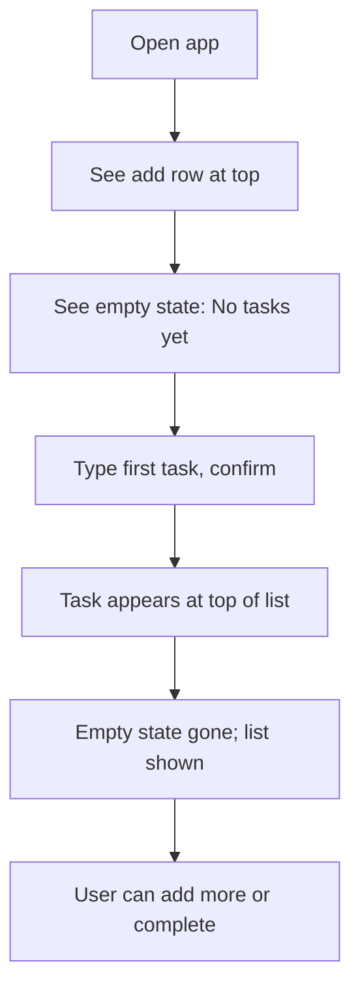

# UX Design Specification bmad-todo

**Author:** RVS
**Date:** 2026-02-16

---

## Executive Summary

### Project Vision

One place for individual developers to track personal tasks—upskilling, POCs, daily work—without spreadsheet complexity. Minimal scope: create task, mark complete, real-time list; server persistence; WCAG 2.1 AA; responsive desktop and mobile. Single user, personal use only for MVP.

### Target Users

Individual developer managing multiple streams of work (upskilling, POCs, daily tasks) who wants one place to track everything instead of scattered notes or tools. Tech-comfortable; uses desktop and mobile; expects fast, simple interactions and real-time feedback.

### Key Design Challenges

- **Simplicity without emptiness** — Empty state must feel inviting and guide users to create their first task without confusion.
- **Speed and feedback** — Create/complete must feel instant (targets: <200 ms UI response, real-time list updates within 2 s); loading and sync states need clear, minimal feedback.
- **Accessibility and responsiveness** — WCAG 2.1 AA (keyboard, screen reader, contrast, focus) and usable layout from desktop to mobile with touch-friendly targets and readable list/add-task flow.
- **Single flow, zero clutter** — One primary flow (list → add → create → complete) with no extra modes or complexity; avoid spreadsheet-like UI.

### Design Opportunities

- **Clear success moments** — The moment a new task appears and the moment it's marked complete are the core "wins"; the UI can make these obvious and satisfying.
- **Confidence and control** — "Delete all" and clear ownership of data support trust; the UI can make data control visible without dominating the screen.
- **Consistent, minimal system** — Small scope allows a tight design system (list, task row, add flow, empty state) that stays coherent and easy to extend post-MVP.

---

## Core User Experience

### Defining Experience

The core loop is: view list → add task → create → see task in list → mark complete. The most frequent actions are viewing the list and marking tasks complete. The critical interaction to get right is add task → create → task appears immediately; if that feels fast and obvious, the rest follows. The experience should feel like one place that's always up to date, with no spreadsheet complexity.

### Platform Strategy

Web SPA only (desktop and mobile). Support latest Chrome, Firefox, Safari, and Edge; responsive layout and touch-friendly targets. Both pointer/keyboard and touch; WCAG 2.1 AA (keyboard and screen reader) from the start. No offline for MVP; assume connected use and real-time updates.

### Effortless Interactions

- **Adding a task** — One clear entry point, type, confirm; no multi-step forms or extra screens.
- **Marking complete** — Single action (e.g. one tap/click) with immediate visual update.
- **Seeing updates** — List reflects create/complete in real time; no manual refresh.
- **First-time use** — Empty state with one obvious "Add task" so the first task is one flow away.

### Critical Success Moments

- **Task appears after create** — New task shows in the list immediately so the user sees the result of their action.
- **Task marked complete** — Completion state and list update right away so the user feels progress.
- **Empty state** — "No tasks" plus a clear Add task path so the first task is easy and non-blocking.

### Experience Principles

- **One place, one flow** — Single linear flow: list and add/complete; no modes or extra steps.
- **Instant feedback** — Every create and complete is reflected in the UI immediately.
- **Zero-friction core actions** — Add and complete use the minimum number of steps.
- **Inclusive by default** — Keyboard, screen reader, and touch work without a separate "accessibility mode."

---

## Desired Emotional Response

### Primary Emotional Goals

- **In control and clear** — Users feel "this is my list; I see what's done and what's next" without confusion.
- **Light accomplishment** — Adding a task and marking it complete feel like small wins, not chores.
- **Calm and focused** — The product stays out of the way so users can focus on their work, not the tool.

### Emotional Journey Mapping

- **First open / empty state** — Welcomed, not lost: "No tasks" plus clear Add task so they feel they can start.
- **During core loop (add, create, complete)** — Ease and immediacy: no waiting or doubt that it worked.
- **After completing a task** — Quiet satisfaction: list is up to date and they can move on.
- **When something goes wrong** — Informed, not anxious: clear message (e.g. "Can't reach server") and a simple path (e.g. retry), no guilt or confusion.
- **Returning later** — Familiar and reliable: same simple flow, data still there.

### Micro-Emotions

- **Confidence over confusion** — Obvious next step (add or complete); empty state that guides.
- **Trust over skepticism** — Data appears and updates in real time; "delete all" reinforces control.
- **Accomplishment over frustration** — One action to complete; list updates so progress is visible.
- **Satisfaction over delight** — Reliable and consistent rather than flashy; the win is "it just works."

### Design Implications

- **In control** → Clear ownership of the list; "delete all" available but not dominant; no hidden or surprising actions.
- **Light accomplishment** → Clear success moments (task appears, task marked complete) with immediate visual feedback.
- **Calm** → Minimal chrome; no unnecessary motion or noise; predictable layout and behavior.
- **Trust** → Real-time updates; clear loading/sync state when needed; honest error messaging.
- **Avoid** → Anxiety (unclear saving/sync), frustration (extra steps to complete), overwhelm (spreadsheet-like density).

### Emotional Design Principles

- **Clarity over cleverness** — Every element supports "what I can do" and "what just happened."
- **Quiet confidence** — The product feels dependable and simple, not needy or loud.
- **Progress is visible** — Completing a task is obvious in the list so users feel they're moving forward.
- **No guilt, no blame** — Errors and empty states are neutral and actionable, not punishing.

---

## UX Pattern Analysis & Inspiration

### Inspiring Products Analysis

Patterns drawn from minimal task and list-oriented products (e.g. single-list tools, lightweight todo apps):

- **Single-list, add-at-top** — One main list with new items at top; no projects or folders in core view. Supports "one place" and reduces decisions.
- **Inline add** — Add control at top of list or single-line expansion. Keeps add to one step and avoids modal-heavy flows.
- **One-tap complete** — Single control per task (e.g. checkbox) with immediate visual update. Aligns with zero-friction and instant feedback.
- **Friendly empty state** — Short message (e.g. "No tasks yet") plus one primary CTA (e.g. "Add your first task"). Reduces confusion and supports "welcomed, not lost."
- **Minimal chrome** — No heavy navigation or sidebars for MVP; list, add, and complete dominate. Supports calm and focus.

### Transferable UX Patterns

- **Navigation:** Single primary view (list or empty state); no tabs or multi-level nav for MVP.
- **Interaction:** Inline or one-step add; single-action complete with immediate list update; "Delete all" in settings or secondary menu so it doesn't dominate the main flow.
- **Visual:** Clear hierarchy (list > task row > control); sufficient contrast and focus for WCAG AA; touch-friendly targets on mobile.

### Anti-Patterns to Avoid

- **Heavy onboarding** — No multi-step wizard for a single-user task list; first run = empty state + one CTA.
- **Hidden or multi-step complete** — Avoid "open task then mark complete"; complete from list in one action.
- **Unclear persistence** — No "Save" buttons or ambiguous sync; create/complete feel saved by default, with clear errors only when sync fails.
- **Spreadsheet-like density** — No dense tables, many columns, or bulk actions for MVP; keep a simple list.
- **Noisy empty state** — Avoid long copy or multiple CTAs; one short message and one primary action.

### Design Inspiration Strategy

- **Adopt:** Single-list plus inline or one-step add, one-tap complete, friendly empty state with one CTA, minimal chrome.
- **Adapt:** "Delete all" available but secondary (e.g. settings or overflow), not prominent; real-time updates instead of manual refresh.
- **Avoid:** Multi-step add, hidden complete, heavy onboarding, dense or multi-column list for MVP.

---

## Design System Foundation

### 1.1 Design System Choice

**Themeable, utility-first foundation:** A utility-first CSS approach (e.g. Tailwind) combined with a small set of accessible UI primitives or components (e.g. Radix UI or a shadcn-style layer). No full-scale established system (e.g. Material or Ant) and no fully custom design system for MVP.

### Rationale for Selection

- **Scope** — MVP has very few components (list, task row, add input, button, checkbox, empty state); a full custom system is unnecessary.
- **Accessibility** — WCAG 2.1 AA is required; using accessible primitives/components reduces risk and effort for focus, keyboard, and screen reader.
- **Emotional and UX goals** — "Calm and focused" and "minimal chrome" are easier with a thin, themeable layer than with a heavy, opinionated system.
- **Team and maintenance** — Solo or small team benefits from less to maintain and from clear documentation (Tailwind + one component approach).

### Implementation Approach

- **Design tokens:** Define a small token set (e.g. colors, spacing, type scale, radii) in CSS or Tailwind config—minimal palette (background, surface, text, border, focus, success/error).
- **Components:** Build only what the flows need: list container, task row (with checkbox/label), add-task input and button, empty state block, optional "Delete all" control. Use accessible primitives for focus and semantics.
- **Single view:** No global nav or sidebar; all components live within the single main view.

### Customization Strategy

- **MVP:** Neutral, low-contrast palette; clear focus ring; touch-friendly hit areas (e.g. 44px min); readable type size. Optional light/dark via tokens.
- **Later:** Same tokens and components; adjust palette or typography if brand is defined; structure remains unchanged.

---

## 2. Core User Experience (Defining Interaction)

### 2.1 Defining Experience

The defining experience is: **Add a task and see it in the list immediately; mark it complete and see it update.** One place that's always up to date. If that feels instant and obvious, the product succeeds. The core action users will describe is "I add tasks and check them off—it's just a list that stays in sync."

### 2.2 User Mental Model

Users bring a **list/checklist** mental model: items to do, check off when done. They expect **immediate feedback** (no "Save" button, no refresh). They're used to **simple add** (type and confirm) and **one action to complete** (e.g. checkbox). Confusion comes from unclear persistence, multi-step flows, or visual noise—not from the list metaphor itself.

### 2.3 Success Criteria

- **"This just works"** — Task appears in the list after create; list updates after complete; no extra step.
- **User feels successful** — When they see the new task and when the completed state is visible.
- **Feedback** — Task in list (create); completed state visible (complete). If sync fails, clear message and retry.
- **Speed** — UI response <200 ms; list update within ~2 s. No manual save; persistence is assumed.

### 2.4 Novel UX Patterns

**Established patterns:** Single list, inline or one-step add, checkbox (or equivalent) to complete. No new interaction to learn. **Unique twist:** Real-time list updates and minimal chrome so the list feels like the only focus—no tabs, no sidebar, no spreadsheet.

### 2.5 Experience Mechanics

**1. Initiation** — User sees list or empty state. Trigger: "Add task" / "Create task" (always visible) or empty-state CTA.

**2. Interaction** — **Add:** User types in one field and confirms (Enter or button). **Complete:** User activates one control per task (e.g. checkbox or row action). System persists and pushes updates; list re-renders.

**3. Feedback** — New task appears in list; completed task shows completed state (e.g. strikethrough, check). If sync fails, show clear message and retry.

**4. Completion** — Done when task is in list (add) or in completed state (complete). Next: user can add another or complete another; no required follow-up step.

---

## Visual Design Foundation

### Color System

- **Neutral base** — Background and surface in soft neutrals (e.g. off-white / light gray for light theme; dark gray for dark) so the list stays the focus.
- **Text** — Primary text dark enough for ≥4.5:1 contrast on background; secondary/muted for completed or supporting text.
- **Semantic** — Primary (e.g. add/create, focus): one accent used sparingly. Success: completed state (e.g. check, subtle green). Error: sync/validation (e.g. red). Focus: visible focus ring (e.g. 2px offset) meeting contrast requirements.
- **Accessibility** — All text/UI contrast ≥ WCAG 2.1 AA; test focus indicators and completed-state contrast.

### Typography System

- **Tone** — Clear and neutral: modern, readable, not playful or corporate.
- **Content** — Mostly short lines (list labels, one-line add); few or no long blocks. Prioritize legibility and hierarchy.
- **Scale** — Small set: one body size (e.g. 16px base), one or two heading levels if needed (e.g. page title, empty state). Line height ~1.5 for body.
- **Fonts** — System font stack or one clean sans (e.g. Inter, Source Sans) for consistency and performance. No brand fonts required.

### Spacing & Layout Foundation

- **Density** — Slightly airy: list rows easy to scan and tap; not cramped.
- **Base unit** — 4px or 8px base grid; spacing in multiples (e.g. 8, 16, 24) for list padding, gaps, and empty state.
- **List** — Consistent vertical rhythm (e.g. 12–16px between rows); comfortable tap targets (e.g. 44px min height for rows/controls on mobile).
- **Grid** — Single-column main content; max-width for readability on large screens (e.g. 560–640px); centered. No complex grid for MVP.

### Accessibility Considerations

- **Contrast** — All text and UI against background ≥ WCAG AA; completed state still readable (e.g. strikethrough + muted color, not gray-on-gray).
- **Focus** — Visible focus ring on all interactive elements (checkbox, input, button); keyboard order matches visual order.
- **Touch** — Minimum 44×44px for interactive elements; adequate spacing between controls to avoid mis-taps.
- **Text** — Support browser zoom; avoid fixed small font sizes so content can scale.

---

## Design Direction Decision

### Design Directions Explored

Six visual directions were generated and published in `_bmad-output/planning-artifacts/ux-design-directions.html`:

1. **Minimal Light** — Off-white background, dark text, simple borders, green for completed state.
2. **Minimal Dark** — Dark background, light text, green accent for Add and completed.
3. **Warm Minimal** — Warm off-white and brown tones, olive completed state.
4. **Compact** — Tighter spacing and slightly smaller type for a denser list.
5. **Airy** — More padding and larger type for a relaxed feel.
6. **Empty states** — "No tasks yet" + single CTA.

### Chosen Direction

**Warm Minimal + Airy spacing, Add at top** — Combines Warm Minimal palette (warm off-white #fefdfb, brown text #2c2419, primary #8b7355, completed #6b8e23) with Airy spacing (e.g. 20px row padding, 24px gaps, 1.125rem body). The **Add task** row is placed **above** the task list so that as the list grows, users do not need to scroll to the bottom to add a new task; the primary action stays at the top and the list scrolls below.

### Design Rationale

- **Warm Minimal** supports "calm and focused" without feeling cold or corporate.
- **Airy spacing** improves scannability and touch targets and aligns with "minimal but not cramped."
- **Add at top** keeps the primary action visible and avoids scroll-to-bottom friction as the list grows; new tasks can be inserted at top of list so "add → see it" remains immediate.

### Implementation Approach

- Use Warm Minimal tokens (background, surface, text, border, primary, success) and Airy spacing (e.g. 20px vertical padding per task row, 24px between add row and list, 44px+ touch targets).
- Place add row (input + Add button) at the top of the main content, above the task list; new tasks appear at top of list.
- Empty state: same add-at-top layout with "No tasks yet" (and optional short copy) below the add row.
- Reference: `_bmad-output/planning-artifacts/ux-design-directions.html` (section "Chosen").

---

## User Journey Flows

### Journey 1: Create and Complete (Happy Path)

**Goal:** User adds a task and marks it complete; list stays in sync.

**Flow:** User opens app → sees add row at top and task list (or empty state) below. User types in add input and confirms (Enter or Add) → new task appears at top of list. User taps/clicks checkbox on a task → task shows completed state (e.g. strikethrough, check), list updates. User can repeat add/complete without leaving the view.

```mermaid
flowchart TD
    A[Open app] --> B{List empty?}
    B -->|Yes| C[See add row + "No tasks yet"]
    B -->|No| D[See add row + task list]
    C --> E[Type task, confirm]
    D --> E
    E --> F[Task appears at top of list]
    F --> G[User taps checkbox on task]
    G --> H[Task shows completed state, list updates]
    H --> I{Add another?}
    I -->|Yes| E
    I -->|No| J[Done]
```

**Success:** Task visible after add; completed state visible after checkbox; no extra steps or refresh.

### Journey 2: Empty State — First Task

**Goal:** User with no tasks adds their first task without confusion.

**Flow:** User opens app → sees add row at top and empty state below ("No tasks yet" + optional short copy). User types in add input and confirms → new task appears at top; empty state is replaced by the list. Same add/complete mechanics as Journey 1 from then on.



**Success:** One clear path to first task; no wizard or extra screens.

### Journey Patterns

- **Single view** — No navigation between screens; add row at top, list (or empty state) below.
- **Add at top** — Add control always at top of content; new tasks inserted at top of list so "add → see it" is immediate and no scroll-to-bottom to add.
- **One action to complete** — Checkbox (or equivalent) on each row; single tap/click, immediate visual update.
- **Real-time feedback** — Create and complete reflected in list without refresh; errors surfaced with clear message and retry.

### Flow Optimization Principles

- **Minimize steps** — Add = type + confirm; complete = one tap; no modals or extra steps for core flow.
- **Clear feedback** — Task in list (add); completed state visible (complete); sync errors explicit.
- **Stable entry point** — Add row at top so the primary action is always in the same place regardless of list length.
- **Graceful errors** — If save/sync fails, show message and retry; do not leave user unsure whether the task was saved.

---

## Component Strategy

### Design System Components

The chosen foundation (utility-first CSS + accessible primitives) provides:

- **Tokens** — Color, spacing, type scale, radii (Warm Minimal + Airy from design direction).
- **Primitives** — Input, button, focusable control (checkbox-style), with focus management and keyboard support.
- **No prebuilt** task list, task row, add row, or empty state; these are custom.

### Custom Components

**Add Row**

- **Purpose:** Let users type and confirm a new task; primary entry for creation.
- **Anatomy:** Single text input (placeholder e.g. "Add a task…") + Add button; laid out in one row at top of content.
- **States:** Default, focus, disabled (e.g. while saving), error (e.g. sync failed).
- **Accessibility:** Label/placeholder for input, visible focus ring, Enter to submit, button with clear label (e.g. "Add").

**Task List**

- **Purpose:** Container for task rows or empty state.
- **Anatomy:** List of task rows when there are tasks; empty state block when list is empty. Add row is above this container.
- **States:** Has tasks / empty.
- **Accessibility:** List semantics (e.g. ul/ol or role="list"); optional live region for dynamic list updates.

**Task Row**

- **Purpose:** Display one task and allow marking it complete.
- **Anatomy:** Checkbox (or equivalent) + task label; completed state (e.g. strikethrough, check icon).
- **States:** Incomplete, complete, focus, optional loading/syncing.
- **Accessibility:** Checkbox with associated label (or aria-label), keyboard toggle, min 44px touch target.

**Empty State**

- **Purpose:** When there are no tasks, explain state and rely on add row at top.
- **Anatomy:** Heading "No tasks yet", optional short copy (e.g. "Add your first task above."); no separate primary button required.
- **States:** Default.
- **Accessibility:** Semantic heading, sufficient contrast.

**Delete All (optional)**

- **Purpose:** Let user remove all task data; secondary, not primary flow.
- **Placement:** E.g. settings, overflow menu, or footer link; not in main add/list chrome.

### Component Implementation Strategy

- Build custom components with design system tokens (Warm Minimal palette, Airy spacing).
- Add row and task row are the critical path; implement and test with keyboard and one screen reader first.
- Reuse one task row component for all rows; differentiate only by state (incomplete/complete) and data.
- Empty state is a simple presentational block; add row remains the primary CTA.

### Implementation Roadmap

- **Phase 1 — Core:** Add row, Task list, Task row, Empty state (enough for Journey 1 and Journey 2).
- **Phase 2 — Polish:** Loading/sync states on add and row if needed; error message component for sync failures.
- **Phase 3 — Optional:** Delete all entry point and confirmation flow.

---

## UX Consistency Patterns

### Button Hierarchy

- **Primary:** One per view — Add (create task). Full weight (e.g. Warm Minimal primary color), clear label "Add".
- **Secondary:** Optional — e.g. "Delete all" in settings/overflow; never competes with Add in the main view.
- **No tertiary needed for MVP.** Buttons use design tokens; focus ring visible for keyboard.

### Feedback Patterns

- **Success (create):** New task appears at top of list; no toast required. Optional brief in-place confirmation if desired.
- **Success (complete):** Task row shows completed state (strikethrough, check) and list updates; no extra message.
- **Error (sync/save):** Inline or small banner (e.g. "Couldn't save. Try again.") with retry; no modal for MVP. Clear, actionable, non-punishing.
- **Loading:** Optional subtle indicator on Add button or list while saving/syncing; avoid blocking the UI.

### Form Patterns

- **Add task:** Single text input + Add button. No multi-field form. Placeholder e.g. "Add a task…".
- **Validation:** Non-empty task text before submit; inline or on submit. No heavy validation UI for MVP.
- **Submit:** Enter key or Add button; one action. After submit, clear input and focus can stay in input for next task.

### Navigation Patterns

- **Single view:** No tabs, no sidebar, no app-level navigation. One scrollable content area: add row at top, list or empty state below.
- **No back/forward** for MVP; optional "Delete all" or settings reached via link/button, not a nav bar.

### Additional Patterns

- **Empty state:** "No tasks yet" + short copy; add row is the primary CTA (at top). No separate big button required.
- **Loading state:** Optional: disabled Add button or spinner while saving; list rows can show optional syncing state.
- **Focus management:** After add, focus can remain in input; after keyboard complete on a row, focus moves predictably (e.g. next focusable in list or back to add).

---

## Responsive Design & Accessibility

### Responsive Strategy

- **Desktop:** Single-column, max-width (e.g. 560–640px), centered. Same structure as mobile: add row at top, list below. No multi-column or sidebar for MVP.
- **Tablet:** Same layout; touch-friendly targets and Airy spacing. No separate tablet layout.
- **Mobile:** Same single view; add row then list. Touch targets min 44px; no hover-only behavior; adequate spacing between tappable elements.

### Breakpoint Strategy

- **Mobile-first.** Base layout works from ~320px; use relative units for spacing. Optional breakpoint(s) only to adjust max-width or padding (e.g. 768px), not to change structure. One linear layout across breakpoints.

### Accessibility Strategy

- **WCAG 2.1 Level AA** (per PRD). Contrast ≥4.5:1 for normal text; focus indicators on all interactive elements; full keyboard operability for add and complete; screen reader support (labels, list semantics, live updates where needed).
- **Touch:** Min 44×44px for checkbox, Add button, and task row tap area.
- **Focus:** Visible focus ring; logical tab order (add input → Add button → list); no focus traps.
- **Semantics:** Label/placeholder for add input; list/list item structure; button and checkbox roles/labels; errors/sync messages in a live region if needed.

### Testing Strategy

- **Responsive:** Test on real phones and tablets; Chrome, Firefox, Safari, Edge (latest); various viewport sizes and zoom.
- **Accessibility:** Automated a11y checks (e.g. axe); keyboard-only pass; at least one screen reader (VoiceOver or NVDA); contrast and touch target verification.

### Implementation Guidelines

- **Responsive:** Prefer rem/%, max-width, mobile-first media queries; avoid fixed px for layout; verify touch targets on device.
- **Accessibility:** Semantic HTML; ARIA where needed (e.g. live region for list updates); keyboard handlers; focus management after add/complete; validate Warm Minimal palette for contrast.

---

<!-- UX design content will be appended sequentially through collaborative workflow steps -->
